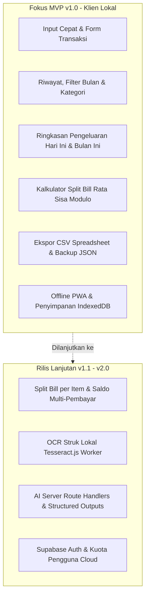
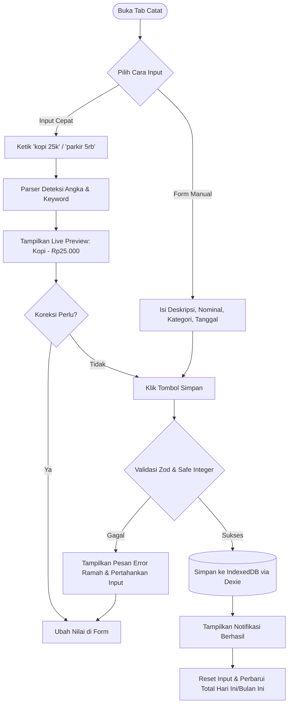
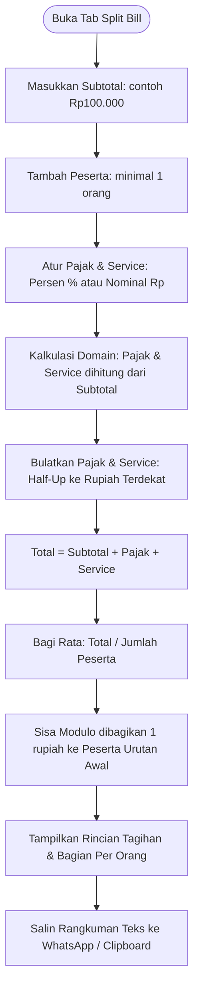
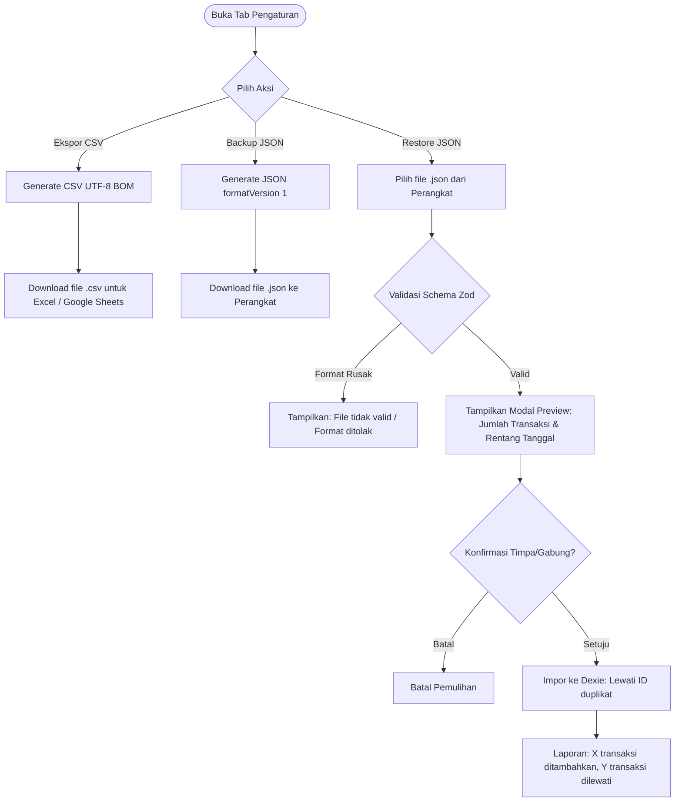
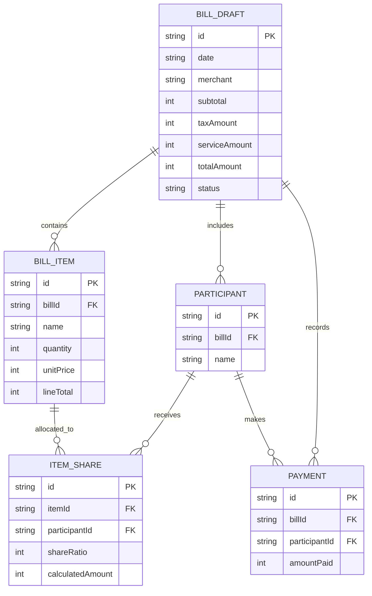

# Dokumen Perancangan Sistem: CatatCepat (Tabsy)
**Tahap 1: Analisis Kebutuhan dan Perancangan Sistem**

---

## 1. Analisis Pengguna & Kebutuhan

### 1.1 Persona Pengguna
| Karakteristik | Mahasiswa (Rian, 21 th) | Pekerja Muda (Siti, 25 th) |
| :--- | :--- | :--- |
| **Kebutuhan** | Mencatat jajan harian tanpa ribet, menghitung patungan nongkrong di kafe/warkop. | Melacak pengeluaran transportasi & makan siang kantor harian, membagi tagihan makan bersama rekan kerja. |
| **Pain Point** | Aplikasi keuangan biasa terlalu rumit (minta registrasi, pilih akun dompet/bank, loading lama). | Sering lupa mencatat pengeluaran kecil; ribet menghitung pajak & service struk makan bareng. |
| **Solusi CatatCepat** | Input kilat satu baris (`kopi 25k`), buka instan offline tanpa login, hitung split bill adil tanpa selisih 1 rupiah pun. |

### 1.2 Batasan Fitur (MVP vs Lanjutan)


---

## 2. Perancangan Alur Pengguna (User Flow)

### 2.1 Alur Pencatatan & Input Cepat (F01, F02)


### 2.2 Alur Split Bill Pembagian Rata (F05)


### 2.3 Alur Backup & Pemulihan Data (F06, F07)


---

## 3. Perancangan Database & Model Data

### 3.1 Skema Database MVP (IndexedDB via Dexie)
Database: `CatatCepatDB` (Version 1)
Tabel: `transactions`
Index: `id`, `date`, `category`, `createdAt`

| Atribut | Tipe Data | Keterangan |
| :--- | :--- | :--- |
| `id` | `string` (UUID v4) | Primary Key unik, digunakan untuk deteksi duplikasi saat restore. |
| `description` | `string` (1–100 chars) | Nama pengeluaran (misal: "Kopi Kenangan"). |
| `amountRupiah` | `integer` (1 s.d. 1.000.000.000) | Nominal rupiah bulat positif, aman dari bug floating point. |
| `category` | `enum` | `'makan' \| 'transport' \| 'belanja' \| 'tagihan' \| 'hiburan' \| 'kesehatan' \| 'pendidikan' \| 'lainnya'` |
| `date` | `string` (YYYY-MM-DD) | Tanggal transaksi lokal perangkat. |
| `createdAt` | `string` (ISO 8601) | Waktu pencatatan data dibuat. |
| `updatedAt` | `string` (ISO 8601) | Waktu perubahan terakhir data. |

### 3.2 Rancangan Relasi untuk Roadmap Lanjutan (v1.1 Split Item & Multi-Pembayar)
Untuk pengembangan v1.1, struktur disiapkan dalam bentuk relasi entitas berikut:



---

## 4. Perancangan Tampilan (Wireframe 4 Layar Utama)

Tampilan dirancang menggunakan pola **Mobile-First App** (tetap proporsional di layar 360px dan terpusat rapi di tablet/desktop dengan bottom navigation bar).

```text
+-------------------------------------------------------------+
| [Header] ⚡ CatatCepat                 (Status: Online/Offline)|
+-------------------------------------------------------------+
|                                                             |
| [1. TAB: CATAT]                                             |
|  +-------------------------------------------------------+  |
|  | Input Cepat: [ ketik "kopi 25k" lalu tekan Enter    ] |  |
|  +-------------------------------------------------------+  |
|  | Live Preview Card: [ Kopi ] [ Rp25.000 ] [ Makan v ]  |  |
|  | Form Detail (Opsional): Tanggal, Kategori, Catatan    |  |
|  | [ Tombol: + Simpan Pengeluaran ]                       |  |
|  +-------------------------------------------------------+  |
|                                                             |
| [2. TAB: RIWAYAT]                                           |
|  +-------------------------------------------------------+  |
|  | Ringkasan: [ Hari Ini: Rp45.000 ] [ Bulan Ini: Rp1.2jt]|  |
|  | Filter: [ Bulan: Oktober 2026 v ] [ Cari: ______ ]    |  |
|  | Chips Kategori: [ Semua ] [ Makan ] [ Transport ] ... |  |
|  | List Transaksi:                                        |  |
|  |  * 04 Okt - Kopi Kenangan   (Makan)       Rp25.000 [Edit]|  |
|  |  * 04 Okt - Bensin Motor    (Transport)   Rp20.000 [Hps] |  |
|  +-------------------------------------------------------+  |
|                                                             |
| [3. TAB: SPLIT BILL]                                        |
|  +-------------------------------------------------------+  |
|  | Subtotal: [ Rp100.000 ]                                |  |
|  | Pajak:    [ 10 ] [% v]  | Service: [ 5 ] [% v]         |  |
|  | Peserta:  [+ Tambah Nama: "Andi", "Budi", "Citra"]     |  |
|  | Hasil:                                                 |  |
|  |  Total: Rp115.000 (Subtotal + Pajak 10k + Service 5k)  |  |
|  |  * Andi  : Rp38.334 (+1 sisa pembulatan)               |  |
|  |  * Budi  : Rp38.333                                    |  |
|  |  * Citra : Rp38.333                                    |  |
|  | [ Salin Rincian ke WhatsApp ]                           |  |
|  +-------------------------------------------------------+  |
|                                                             |
| [4. TAB: PENGATURAN]                                        |
|  +-------------------------------------------------------+  |
|  | Info: Data disimpan 100% lokal di browser HP Anda.     |  |
|  | [ Download File CSV (Excel) ]                          |  |
|  | [ Backup Data (JSON) ]                                 |  |
|  | [ Pulihkan Data (Restore JSON) ]                       |  |
|  +-------------------------------------------------------+  |
|                                                             |
+-------------------------------------------------------------+
| [NAV BOTTOM]  (⚡ Catat)  (📋 Riwayat)  (👥 Split)  (⚙️ Pengaturan) |
+-------------------------------------------------------------+
```

---

## 5. Ringkasan & Validasi Kesiapan
- Semua aturan validasi, penanganan error, rumus matematika, dan skema database pada Tahap 1 ini sudah diverifikasi secara otomatis menggunakan pengujian unit (`npm test` 9/9 passed).
- Siap diimplementasikan ke antarmuka pengguna interaktif pada **Tahap 2**.
