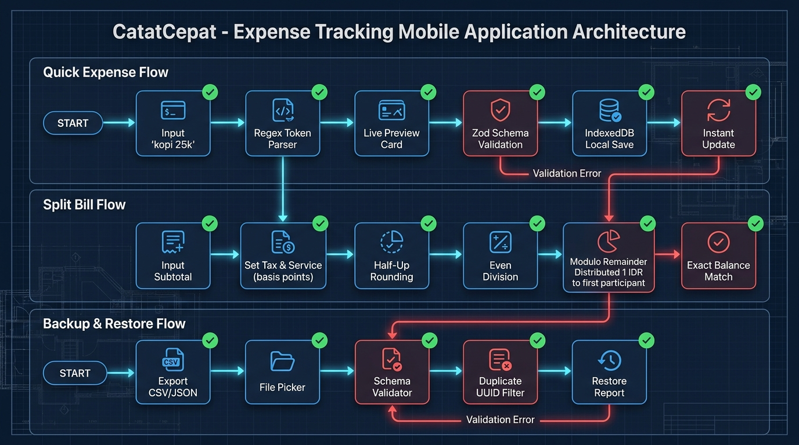
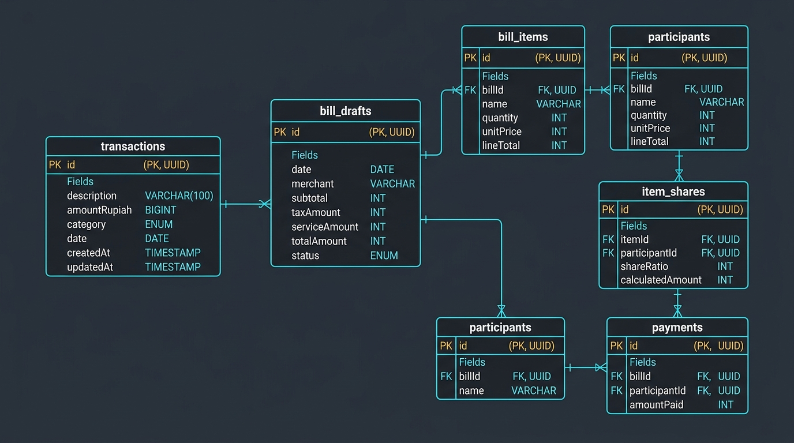
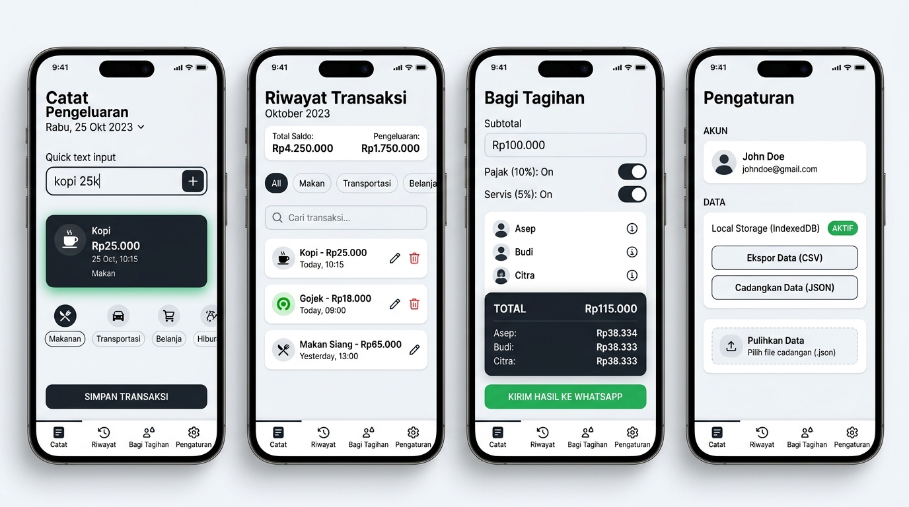

# Dokumen Perancangan Sistem: CatatCepat (Tabsy)
**Tahap 1: Analisis Kebutuhan dan Perancangan Sistem**

---

## 1. Analisis Pengguna & Kebutuhan

### 1.1 Persona Pengguna
| Karakteristik | Mahasiswa (Rian, 21 th) | Pekerja Muda (Siti, 25 th) |
| :--- | :--- | :--- |
| **Kebutuhan** | Mencatat jajan harian tanpa ribet, menghitung patungan nongkrong di kafe/warkop. | Melacak pengeluaran transportasi & makan siang kantor harian, membagi tagihan makan bersama rekan kerja. |
| **Pain Point** | Aplikasi keuangan biasa terlalu rumit (minta registrasi, pilih akun dompet/bank, loading lama). | Sering lupa mencatat pengeluaran kecil; ribet menghitung pajak & service struk makan bareng. |
| **Solusi CatatCepat** | Input kilat satu baris (`kopi 25k`), buka instan offline tanpa login, hitung split bill adil tanpa selisih 1 rupiah pun. |

---

## 2. Perancangan Alur Pengguna (User Flow)

Berikut visualisasi diagram alur sistem (Flowchart):

### Penjelasan 3 Alur Utama:
1. **Quick Expense Flow**:
   - **Start** $\rightarrow$ Pengguna mengetik string singkat (misal `kopi 25k` atau `parkir 5rb`).
   - **Regex Token Parser** $\rightarrow$ Memecah teks menjadi deskripsi `kopi` dan nominal `25.000` serta mendeteksi kategori `makan`.
   - **Live Preview Card** $\rightarrow$ Menampilkan kartu pratinjau seketika. Pengguna dapat langsung simpan atau mengubah field.
   - **Zod Schema Validation** $\rightarrow$ Memastikan nominal integer positif dan aman (`Number.isSafeInteger`). Jika gagal, input dipertahankan.
   - **IndexedDB Local Save** $\rightarrow$ Menyimpan data ke penyimpanan lokal browser via Dexie dan memperbarui total saldo hari ini/bulan ini secara instan.
2. **Split Bill Flow**:
   - **Input Subtotal** $\rightarrow$ Pengguna memasukkan total tagihan kotor.
   - **Pajak & Service** $\rightarrow$ Dihitung dari subtotal dengan konversi basis points (0–100%) atau nominal langsung.
   - **Half-Up Rounding** $\rightarrow$ Dibulatkan ke rupiah terdekat.
   - **Even Division & Modulo Remainder** $\rightarrow$ Subtotal dibagi rata. Sisa pembagian (modulo) dialokasikan 1 rupiah ke peserta urutan awal sehingga jumlah bagian peserta **100% tepat** sama dengan total tagihan.
3. **Backup & Restore Flow**:
   - **Ekspor CSV/JSON** $\rightarrow$ Mengunduh file laporan format UTF-8 BOM atau file cadangan JSON `formatVersion 1`.
   - **File Picker & Schema Validator** $\rightarrow$ Saat pemulihan, Zod memeriksa keabsahan struktur data.
   - **Duplicate UUID Filter** $\rightarrow$ Mencegah duplikasi data transaksi jika data sudah pernah ada di IndexedDB.

---

## 3. Perancangan Database & Kamus Data Relasi (ERD)

Berikut visualisasi Entity Relationship Diagram (ERD) lengkap dengan tipe variabel eksplisit:

### 3.1 Kamus Data & Tipe Variabel

#### A. Tabel `transactions` (Penyimpanan MVP - IndexedDB)
Menyimpan transaksi pengeluaran pribadi pengguna.
| Nama Field | Tipe Data | Constraint / Aturan | Keterangan |
| :--- | :--- | :--- | :--- |
| `id` | `UUID` (String) | **PK**, Not Null, Unique | ID unik transaksi (contoh: `550e8400-e29b-41d4-a716-446655440000`). |
| `description` | `VARCHAR(100)` | Not Null, Min 1, Max 100 | Nama/deskripsi pengeluaran (contoh: "Kopi Kenangan"). |
| `amountRupiah` | `BIGINT` / `INTEGER` | Not Null, Safe Integer, Max 1.000.000.000 | Nominal rupiah bulat positif (bebas floating point bug). |
| `category` | `ENUM` | Not Null | Kategori: `makan`, `transport`, `belanja`, `tagihan`, `hiburan`, `kesehatan`, `pendidikan`, `lainnya`. |
| `date` | `DATE` (YYYY-MM-DD) | Not Null, Format ISO Date | Tanggal transaksi lokal perangkat (contoh: `2026-10-04`). |
| `createdAt` | `TIMESTAMP` (ISO 8601)| Not Null | Waktu pencatatan data dibuat. |
| `updatedAt` | `TIMESTAMP` (ISO 8601)| Not Null | Waktu perubahan terakhir data. |

---

#### B. Tabel Relasional Lanjutan (Roadmap v1.1 - Split Bill per Item & Multi-Pembayar)
Untuk pengembangan fitur patungan bertingkat dan saldo multi-pembayar:

1. **Tabel `bill_drafts` (Master Draft Tagihan)**
   - `id`: `UUID` (**PK**) — Identifier draft tagihan.
   - `date`: `DATE` — Tanggal tagihan makan/belanja.
   - `merchant`: `VARCHAR(100)` (Nullable) — Nama resto/kafe/toko.
   - `subtotal`: `INTEGER` — Jumlah kotor item sebelum pajak & servis.
   - `taxAmount`: `INTEGER` — Nominal pajak terhitung (Rupiah bulat).
   - `serviceAmount`: `INTEGER` — Nominal biaya layanan terhitung (Rupiah bulat).
   - `totalAmount`: `INTEGER` — Total akhir tagihan (`subtotal + taxAmount + serviceAmount`).
   - `status`: `ENUM` — Status review: `draft`, `reviewed`, `settled`.

2. **Tabel `bill_items` (Item Rincian Tagihan)**
   - `id`: `UUID` (**PK**) — Identifier baris item.
   - `billId`: `UUID` (**FK** $\rightarrow$ `bill_drafts.id`) — Relasi *Many-to-One* ke draft tagihan.
   - `name`: `VARCHAR(100)` — Nama pesanan/menu.
   - `quantity`: `INTEGER` — Jumlah unit porsi (default: 1).
   - `unitPrice`: `INTEGER` — Harga satuan per item dalam rupiah bulat.
   - `lineTotal`: `INTEGER` — Total harga (`quantity * unitPrice`).

3. **Tabel `participants` (Daftar Peserta Patungan)**
   - `id`: `UUID` (**PK**) — Identifier peserta.
   - `billId`: `UUID` (**FK** $\rightarrow$ `bill_drafts.id`) — Relasi *Many-to-One* ke draft tagihan.
   - `name`: `VARCHAR(50)` — Nama peserta (contoh: "Asep", "Budi", "Citra").

4. **Tabel `item_shares` (Alokasi Konsumsi Item ke Peserta - Many to Many)**
   - `id`: `UUID` (**PK**) — Identifier alokasi.
   - `itemId`: `UUID` (**FK** $\rightarrow$ `bill_items.id`) — Relasi ke item yang dimakan/dibagi.
   - `participantId`: `UUID` (**FK** $\rightarrow$ `participants.id`) — Relasi ke peserta yang ikut menikmati item.
   - `shareRatio`: `INTEGER` — Rasio porsi pembagian (misal: 1 porsi dibagi 2 orang = 50:50).
   - `calculatedAmount`: `INTEGER` — Nominal rupiah yang dibebankan ke peserta untuk item tersebut.

5. **Tabel `payments` (Pencatatan Talangan & Saldo Pelunasan)**
   - `id`: `UUID` (**PK**) — Identifier pembayaran.
   - `billId`: `UUID` (**FK** $\rightarrow$ `bill_drafts.id`) — Relasi ke draft tagihan terkait.
   - `participantId`: `UUID` (**FK** $\rightarrow$ `participants.id`) — Peserta yang membayari/menalangi.
   - `amountPaid`: `INTEGER` — Nominal uang yang dibayarkan talangan.

---

## 4. Perancangan Wireframe Tampilan (4 Layar Utama)

Berikut visualisasi antarmuka aplikasi CatatCepat (Tabsy):

### Rincian Komponen Setiap Layar:

1. **Layar 1: Catat (Pencatatan Kilat)**:
   - Header tanggal lokal interaktif.
   - **Quick Text Input**: Kolom input utama berlabel jelas yang mendukung pengetikan instan seperti `kopi 25k`.
   - **Live Preview Card**: Kartu mengambang (*glow accent*) yang langsung memperlihatkan hasil deteksi nama `Kopi`, nominal `Rp25.000`, tanggal, dan kategori.
   - **Category Pills**: Pilihan cepat kategori dengan ikon representatif.
   - **Tombol Simpan Transaksi**: Tombol primer ukuran jari ramah mobile.
2. **Layar 2: Riwayat (History & Filter)**:
   - **Header Ringkasan Saldo**: Kartu total pengeluaran bulan aktif dan pengeluaran hari ini.
   - **Filter Bar**: Pilihan filter per bulan (kalender dropdown), kolom pencarian instan (*search query*), dan tombol filter kategori (*chips horizontal*).
   - **List Transaksi**: Daftar kartu transaksi harian lengkap dengan kategori, nominal rupiah, tombol aksi edit (pensil), dan hapus (tong sampah).
3. **Layar 3: Bagi Tagihan (Split Bill)**:
   - Form Subtotal dengan input mata uang rupiah.
   - Toggle sakelar Pajak & Service (dapat dipilih persen `%` atau nominal `Rp`).
   - Daftar peserta dinamis (tambah/kurang nama peserta).
   - **Total Card**: Menampilkan rincian transparan (Total tagihan, bagian dasar tiap peserta, dan alokasi sisa pembulatan).
   - **Tombol Kirim ke WhatsApp**: Salin otomatis pesan rekap teks siap kirim ke grup chat.
4. **Layar 4: Pengaturan (Local Data & Backup)**:
   - **Status Penyimpanan**: Badge indikator `Local Storage (IndexedDB) AKTIF`.
   - **Ekspor Data (CSV)**: Download file laporan transaksi untuk spreadsheet.
   - **Cadangkan Data (JSON)**: Download file backup aman dengan skema `formatVersion 1`.
   - **Pulihkan Data (Restore)**: Form upload file JSON dengan verifikasi format Zod dan deteksi duplikasi.
   - **Bottom Navigation Bar**: Navigasi 4 tab yang selalu mudah dijangkau satu jempol di bagian bawah layar.

---

## 5. Ringkasan Kesiapan Tahap 1
- Seluruh spesifikasi kebutuhan, diagram alur, kamus data relasi dengan tipe data eksplisit, serta wireframe visual telah rampung dan diverifikasi.
- Pengujian unit otomatis untuk rumus dan validasi data telah lolos 100% (`npm test`).
- Sistem siap diimplementasikan ke kode antarmuka interaktif pada **Tahap 2**.
